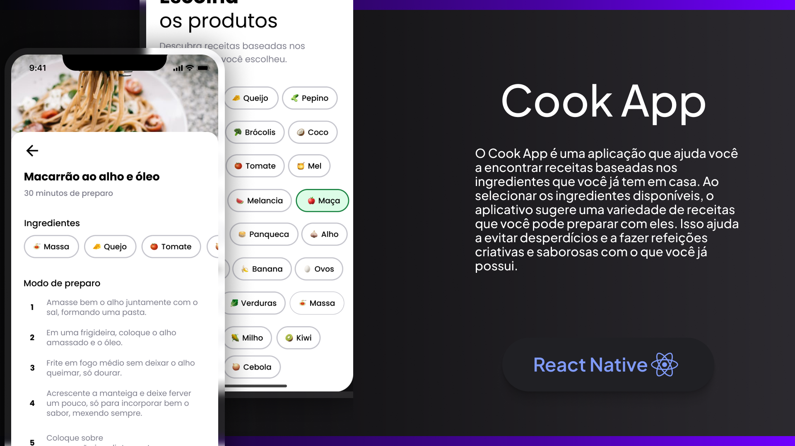

<h1 align="center">
  
</h1>

### Links

🔴 **Figma do projeto:** [Cook App](https://www.figma.com/community/file/1346604268107725445/cook-app)

---

<h1 align="center">
  
</h1>

### Sobre o projeto

Imagine chegar em casa com fome depois de um dia de muito trabalho e lembrar que você esqueceu de passar no mercado para fazer as compras da semana. Então você decide abrir a geladeira pra fazer uma janta com o que já tem em casa, mas está sem muita criatividade pra cozinhar.

**É esse problema que o Cook App pode resolver!** 

Nessa aula do evento "React Native na prática", vamos criar uma aplicação que sugere receitas conforme os ingredientes selecionados **usando React Native, Expo, Expo Router, Supabase e React Native Reanimated**.

## Tecnologias Utilizadas

- **React Native** (versão 0.74.2): Framework para desenvolvimento de aplicativos móveis.
- **Expo** (versão ~51.0.17): Ferramenta e plataforma para desenvolvimento de aplicativos React Native.
- **Expo Router** (versão ~3.5.17): Gerenciamento de navegação em aplicações Expo.
- **Supabase** (versão ^2.44.2): Plataforma de backend como serviço (BaaS) que fornece banco de dados e autenticação.
- **React Native Reanimated** (versão ~3.10.1): Biblioteca para animações no React Native.

## Requisitos

- **Node.js** (versão 14.x ou superior)
- **npm** (versão 6.x ou superior)
- **Expo CLI** (versão mais recente)
- **Conta no Supabase**

## Passo a Passo para Configuração

### 1. Clonar o Repositório

Primeiro, clone o repositório para sua máquina local usando Git:

